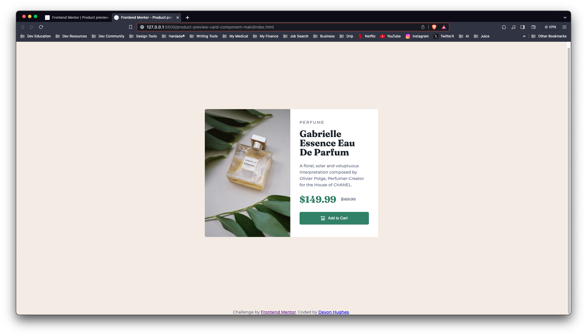
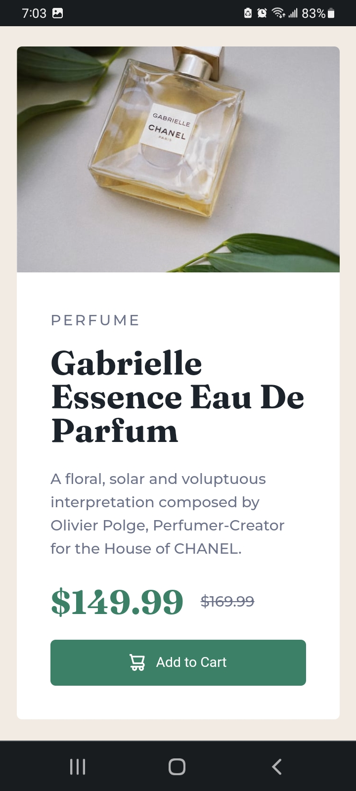

# Frontend Mentor - Product preview card component solution

This is a solution to the [Product preview card component challenge on Frontend Mentor](https://www.frontendmentor.io/challenges/product-preview-card-component-GO7UmttRfa). Frontend Mentor challenges help you improve your coding skills by building realistic projects. 

## Table of contents

  - [The challenge](#the-challenge)
  - [Screenshot](#screenshot)
  - [Links](#links)
  - [Built with](#built-with)
  - [Continued development](#continued-development)
- [Author](#author)
- [Acknowledgments](#acknowledgments)

### The challenge

Users should be able to:

- View the optimal layout depending on their device's screen size
- See hover and focus states for interactive elements

### Screenshot

### Links

- Solution URL: [Add solution URL here](https://your-solution-url.com)
- Live Site URL: [Add live site URL here](https://your-live-site-url.com)

### Built with

- Semantic HTML5 markup
- CSS custom properties
- Flexbox
- CSS Grid
- Visual Studio Code

### Continued development

HTML5, CSS, and Javascript.

## Author

- CodePen - [Devon Hughes](https://codepen.io/Devon-Hughes-the-decoder)
- Frontend Mentor - [@DevonHughesCodes](https://www.frontendmentor.io/profile/DevonHughesCodes)
- Twitter - [@HughesDevDesign](https://twitter.com/HughesDevDesign)

## Acknowledgments

Thank you to Frontend Mentor for providing these great excercises.
